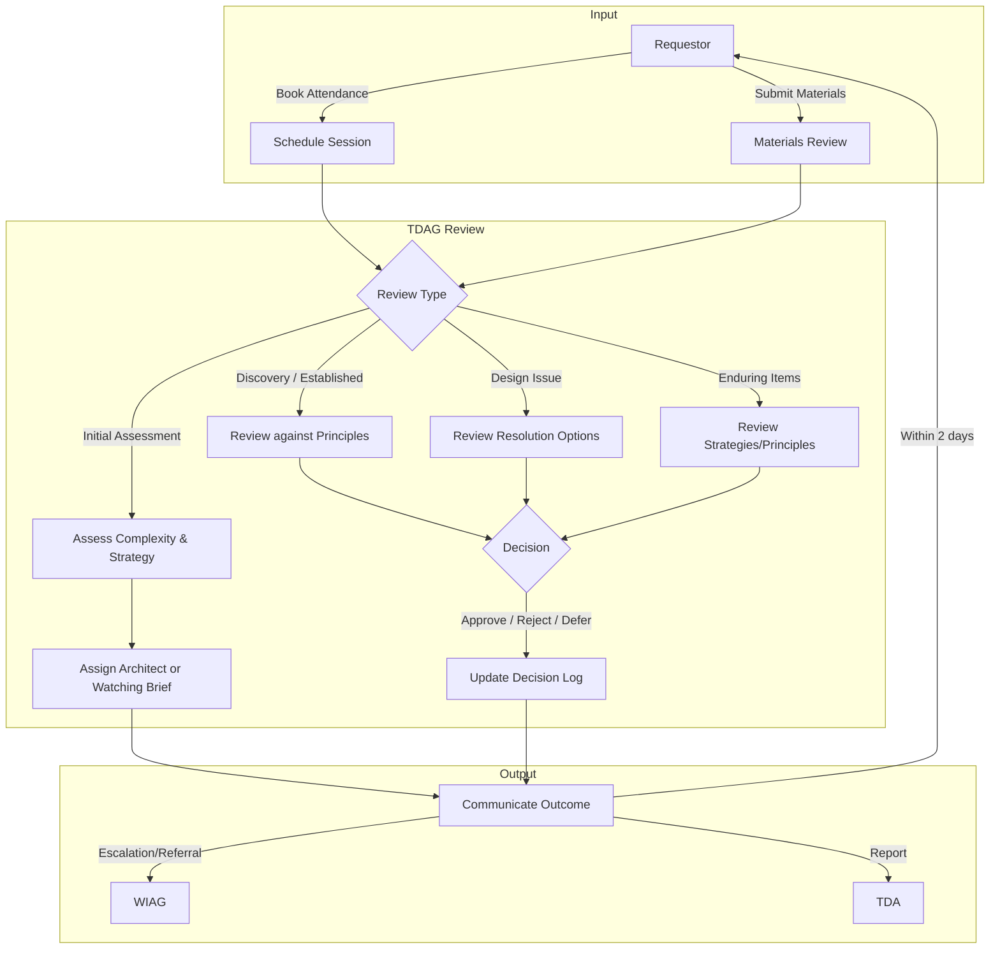

# TDAG Terms of Reference

## Purpose of the Group

The Technical Design Assurance Group (TDAG) is an assurance group
internal to DHCW and has been established to maintain the integrity of
DHCW's enterprise architecture by:

* Reviewing and approving the **architecture and design** of significant
  changes to the platforms and products that comprise our
  architecture. These include products and platforms designed and
  developed 'in house' as well as those procured from third parties to
  meet specific clinical and technical requirements.

* Approving any variance to agreed architecture, principles and
  standards to ensure that new and changed platforms and products are
  fit for purpose.

* Proposing new principles, standards and design patterns to the
  [Technical Design Authority (TDA)](tda-terms-of-reference.md) for adoption.

The group has the authority to exercise judgment to assure architecture
and design and ensure compliance with approved principles, standards,
patterns and architecture roadmaps.

The group will comprise of DHCW experts from a range of disciplines to
provide subject matter knowledge and guidance to approve submitted
requests in a timely manner.

This group will report to the Wales Informatics Assurance Group (WIAG);
where a proposal would normally come within the assurance scope of WIAG
(or where a proposal changes the scope of an existing WIAG approval),
the group will refer the proposal to WIAG for full assurance. Otherwise,
the group will retrospectively report approvals to WIAG.

This group will report and escalate to the Technical Design Authority (TDA).

## Objectives of the Group

* Provide expert advice and opinion to support the wider assurance
  process (WIAG)

* Review and approve, defer or reject **high level summaries of planned change**

* Review and approve, defer or reject **requirements specifications**
  including:

    * Software Requirement Specifications (SRS)
    * Use Cases
    * Relevant sections of procurement specifications.

* Review and approve, defer or reject **enterprise, solution & technical architecture**, including:

    * [Architecture Design Overviews](architecture-design-overview-template.md)
    * [Architecture Decision Records](architecture-decision-record-template.md)
    * Platform roadmaps
    * Architecture Building Blocks
    * Relevant sections of product roadmaps.
    * Infrastructure Design documents

* Maintain formal log of approved design documentation
* Responsible for escalated design associated risks
* Maintain formal log of escalated design associated risks

*NB. Additional detailed "deep dive" sessions may be scheduled at the
request of TDAG members to facilitate review and approval of specific
design items.*

## Meetings

* **Frequency**: The group shall meet every two weeks to discuss requests
for actioning and approval.

* **Format**: The meeting will be conducted using Microsoft Teams, "Face
to Face" or hybrid.

* **Request input**: The group shall receive requests electronically via a
ring-fenced MS Teams Channel.

## Membership

Members attending will represent their area of work. There is an
expectation that each work area will provide a representative, either
nominated or suitably trained deputy for their subject matter to the
group; and have authority to act accordingly.

| Role                  | Responsibility |
| :-------------------- | :------------- |
| **Executive Sponsor** | Executive Director of Operations |
| **Chair**             | Chief Product and Technology Officer |
| **Vice Chairs**       | Head of Enterprise Architecture, Head of Solution Architecture |
| **Facilitator**       | The facilitator will act as the 'product owner' for the Technical Design Assurance Group: serving as a primary point of contact for those attending TDAG; providing oversight for quality of inputs and outputs; driving continuous improvement to TDAG |
| **Secretariat**       | Directorate Admin, Operations. |

The membership of the group will be as follows:

| Area                              | Quorum? | Responsibility |
| :-------------------------------- | :-----: | :------------- |
| **Technology Ops & Architecture** |   Yes   | Infrastructure (platforms) operations & design impact |
| **Cyber Security**                |   Yes   | Cyber security design |
| **Data & Digital Ops**            |   Yes   | Digital (products) impact |
| **Architecture**                  |   Yes   | Architecture alignment (Enterprise, Solution, General) |
| **Software Engineering**          |   Yes   | Software development standards, software developer's viewpoint |
| **NDR**                           |   Yes   | Target Data Architecture |
| **M365 Centre of Excellence**     |   No    | Represent and voice opportunities to exploit our investment in M365 platform |

Additional members will attend adhoc to support and present work to the group.

## Key Relationships

The group will:

* To requestor - Inform the requestor within two working days of the
  meeting with one of the following outputs for their presentation
  \[Approved, Rejected, Deferred\]

* To WIAG - Provide responses to requests from its members:

    * Decisions made by the Technical Design Assurance Group
    * Decisions referred by the Technical Design Assurance Group

* To TDA - Provide a six weekly report detailing:

    * Decisions made in period by the Technical Design Assurance Group
    * Decisions referred in period by the Technical Design Assurance
    Group

Any escalations will be referred to WIAG for matters within WIAG's scope
or otherwise to the TDA.

## Governance

The group will report to TDA. Each member of the group will have
explicit delegated responsibility from their Director to make decisions
within their remit. This will be supported by standard delegation,
approval documentation and will be consistent with standing financial
instructions.

All materials (inc. decisions and scheduling) will be managed within a
ring-fenced Teams Channel available.

*Members and attendees will be allocated the necessary access,
facilitator and secretariat will administer additional access*

## Outputs

The Group will report TDAG outcomes to requestors via the ring-fenced
Teams channel, and WIAG and TDA as described above.

The group will formally record its approval and any caveats or
annotations to the approval in any request received. It will also
capture any deviations that an approved proposed design is making from
principles, and standards and maintain these within its decision log.

The group will ensure its action and decision log is always available
for scrutiny.

## Definitions

|    TERM     | DEFINITION |
| :---------: | :--------- |
| **ADO**     | Architecture Design Overview |
| **ADR**     | Architecture Design Record |
| **AAAG**    | Application and Architecture Assurance Group *(TDAG's predecessor)* |
| **ADS**     | Application, Development & Support |
| **DHCW**    | Digital Health and Care Wales |
| **IDD/DES** | Infrastructure Design Document |
| **SRS**     | Software Requirements Specification |
| **SAD**     | Solution Architecture Design / Document *(ADO predecessor)* |
| **TDA**     | Technical Design Authority |
| **TDAG**    | Technical Design Assurance Group |
| **WIAG**    | Welsh Informatics Assurance Group |

## Appendix A: Process for Review and Approval

Submissions into the Technical Design Assurance Group will follow a
self-service model wherever possible.

* Attendance can be booked for TDAG via an interactive calendar within
  the Teams channel

* Materials will be made available for members to review ahead of the
  session (c. 6-7 days)

* Published outcomes (approve, defer, reject) and minutes will be
  available within the same Teams channel post session

## Appendix B: Shift Left Assurance

**Purpose**: to describe at a high level how the Technical Design Assurance
Group should review projects / programmes / change in an iterative manner in
order to shift assurance earlier in the lifecycle.

Review / approval within the Technical Design Assurance Group should be considered within five groupings:

1. **Initial assessment of change** - assessing levels of architectural / technical complexity, alignment to strategy and confirming the architecture support required.
2. **Discovery / Concept stage Design review** - assessing the 'fit' of the planned change against design principles, confirming early design dependencies & assumptions.
3. **Established change Design review** - provides refreshed assessment of 'fit' vs design principles, ensures design matches expectations.
4. **Design Issue resolution** - Enduring relationship throughout the lifecycle between projects / programmes to resolve blockers.
5. **Enduring items** - Platform strategies, product strategies and new/updated design principles.

Groups 3 and 5 continues AAAG methodology and are very well established.
Examples of Groups 2 & 4 are becoming common types of agenda items.

Group 1 remains the most complex to deliver, but also where significant
enterprise-level value can be obtained.

### Initial Assessment of Change

**Timeline:** As early as possible in the lifetime of the planned change.

**Inputs:**

A templated summary of the planned change allowing for a collective review against set criteria:

* Is there a new service / functionality required? Is it meeting a temporary or long-term need?
* Are there reusable technologies already in-house that could meet this need?
* Is the project delivering repeatable / low complexity change?
* Is there an expectation of technical debt or manual workaround created by this change?

**Outputs:**

Either:

* Confirmed level of assigned architect resource OR

* Approval to proceed under architect "watching brief" / without architect intervention (Presenter to reach out to architecture function if design challenges experienced)

### Discovery Design Review

**Timeline:** Before exit from Discovery - to allow for WIAG approval of
Safety Case and Readiness report, if applicable.

**Inputs:**

Utilising SRS, IDD, SAD, DES and Platform/Product Strategies to:

* Conduct detailed review of planned change -- how it meets design principles and aligns to business requirements and supports the delivery of strategic business objectives and outcomes.
* Draw out impacts upon Technology, High level Processes, Locations, Available products / services, Available channels.
* Confirm and agree in-scope and out of scope items and anticipated design risks.

**Outputs:**

* Formal approval / rejection / deferral to proceed with planned design.
* Formal approval / rejection / deferral of any compromise where design principles cannot be fully met. Agree levels of acceptable technical debt, manual workaround, if applicable.

### Established Change Design Review

**Timeline:** Before exit from Development phase of change - to allow for WIAG
approval of Safety Case and Readiness report, if applicable.

**Inputs:**

Utilising SRS, IDD, SAD, DES and Platform/Product Strategies to provide a **refreshed** summary of planned change:

* Describe updated assessment of fit vs design principles.
* Illustrate refreshed view of impacts across the organisation.

Discussion to draw out:

* Key design risks and design dependencies identified, de-scoped items and design assumptions that have been disproved since last review.

**Outputs:**

* Formal approval / rejection / deferral to continue to proceed with planned design.
* Formal approval / rejection / deferral of any newly established compromise where design principles cannot be fully met or re-approval of previous position. Ditto for technical debt, manual workaround, if applicable.

### Design Issue Resolution

**Timeline:** Enduring throughout all phases.

**Inputs:**

* Clear statement of issue being experienced, and its impact upon planned design / progress.

* Draw out impacts, options for resolution *(avoid / reduce / transfer / accept)*, the preferred option and its rationale.

**Outputs:**

* Formal approval / rejection / deferral to continue to proceed with preferred option.
